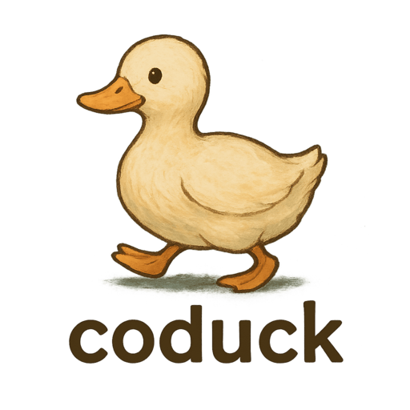
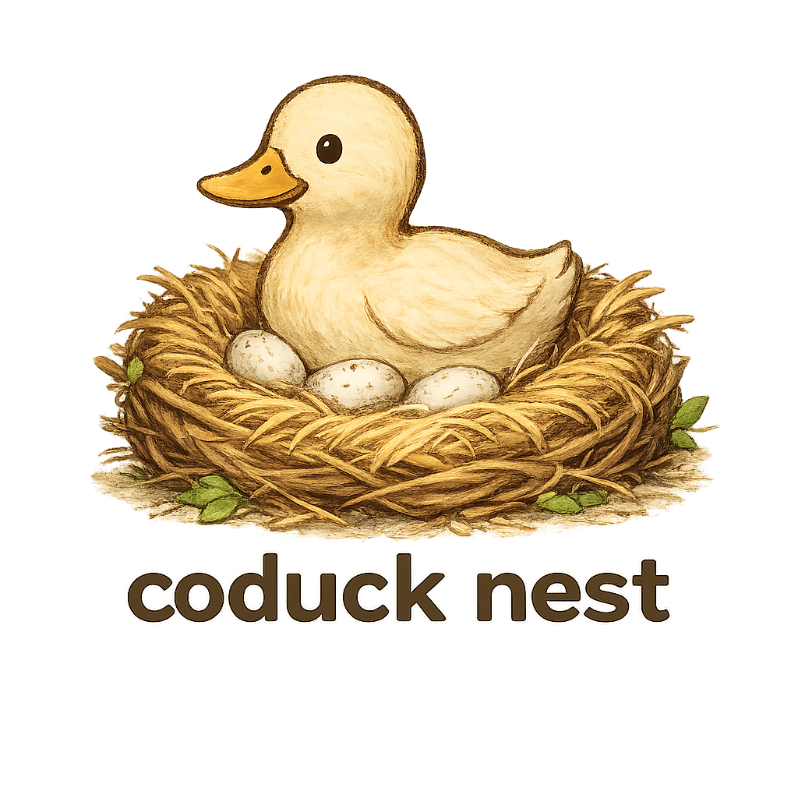

    
    

# Welcome to Coduck Project

In the ever-evolving landscape of competitive programming, the need for a robust and versatile platform to create and manage contest problems is paramount. Enter Coduck—an innovative platform designed to revolutionize the way programming contest problems are created, curated, and managed. Heavily inspired by Polygon, a widely respected tool in the competitive programming community, Coduck aims to provide an enhanced, user-friendly experience for problem setters and contest organizers alike.

Coduck combines the essential features of Polygon with additional enhancements to streamline the problem creation process. Our platform is designed to address the specific needs of problem setters, ensuring that the entire lifecycle of problem creation—from conception and development to testing and validation—is both efficient and enjoyable. With an intuitive interface and powerful tools, Coduck empowers users to focus on crafting high-quality problems while minimizing the overhead associated with administrative tasks.

Key features of Coduck include a comprehensive problem editor, automated test case generation, integrated version control, and collaboration tools. These features work in harmony to provide a seamless experience, allowing teams to work together efficiently, whether they are in the same room or across the globe. Additionally, Coduck's robust validation mechanisms ensure that each problem meets the highest standards of quality and fairness before being used in a contest.
